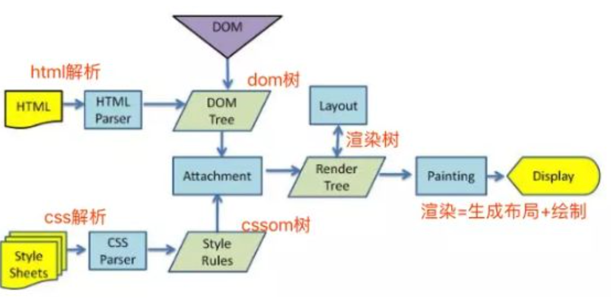

## 前端应用的广泛

### 1、web 开发

- 原生 JavaScript
- React 开发
- Vue 开发
- Angular 开发

### 2、移动端开发

- ReactNative
- Weex

### 3、小程序端开发

- 支付宝小程序
- 微信小程序
- uniapp
- taro

### 4、桌面应用开发

- electron（vscode）

### 5、后端开发

- Node 环境（express、koa、egg.js）
<!-- # 浏览器工作原理 -->

## 浏览器内核和原理

### 1. 内核组成

- **Gecko**,早期被 `Netscape` 和 `Mozilla` `Firefox` 浏览器浏览器使用；
- **Trident**：微软开发，被 IE4~IE11 浏览器使用，但是 `Edge` 浏览器已经转向 Blink；
- **Webkit**：苹果基于 KHTML 开发、开源的，用于 `Safari，Google` Chrome 之前也在使用；
- **Blink**：是 Webkit 的一个分支，`Google` 开发，目前应用于 `Google` `Chrome、Edge、Opera` 等；

### 2. 浏览器渲染过程

### 3. JS 引擎

- **SpiderMonkey**:第一款 `JavaScript` 引擎，由 `Brendan Eich` 开发(也就是 JavaScript 作者);
- **Chakra**:微软开发，用于 IT 浏览器;
- **JavaScriptCore**:`WebKit` 中的 `JavaScript` 引擎，`Apple` 公司开发;
- **V8**:Google 开发的强大 `JavaScript` 引擎，也帮助 `Chrome` 从众多浏览器中脱颖而出;

### 4. JS 引擎和浏览器内核的关系

Webkit= WebCore + JavaScriptCore(JSCore)

<!-- <RecoDemo>
  <template slot="code-html">
    <<< @/docs/.vuepress/code/nav/index.html
  </template>
  <template slot="code-css">
    <<< @/docs/.vuepress/code/nav/index.css
  </template>
  <template slot="code-js">
    <<< @/docs/.vuepress/code/nav/index.js
  </template>
</RecoDemo>

<RecoDemo>
  <template slot="code-template">
    <<< @/docs/.vuepress/code/demo/demo.vue?template
  </template>
  <template slot="code-script">
    <<< @/docs/.vuepress/code/demo/demo.vue?script
  </template>
  <template slot="code-style">
    <<< @/docs/.vuepress/code/demo/demo.vue?style
  </template>
</RecoDemo> -->
