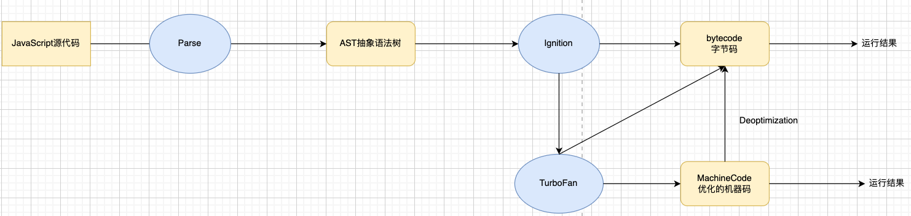
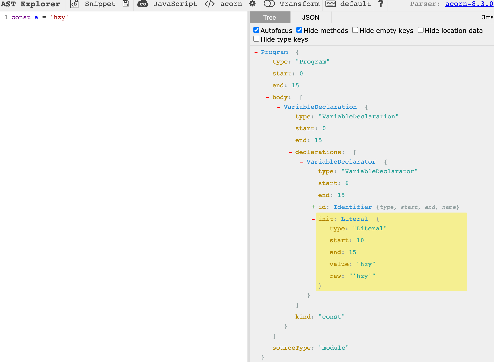
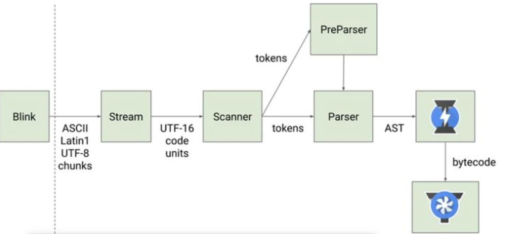

## V8 引擎的原理

### 1. **官方定义**

- `V8` 是用 C ++编写的 `Google` 开源高性能 `JavaScript` 和 `WebAssembly` 引擎，它用于 `Chrome` 和 Node.js 等。
- 它实现 `ECMAScript` 和 `WebAssembly`，并在 Windows 7 或更高版本，macOS 10.12+和使用 x64，IA-32， ARM 或 MIPS 处理器的 Linux 系统上运行。
- V8 可以独立运行，也可以嵌入到任何 C ++应用程序中。

### 2. V8 引擎架构图

- **Parse：转换器**
  - 我们可以将写的代码复制到下面网站，查看编译出的[语法树](https://astexplorer.net/)。
  - 
- **Ignition：解释器**
  - 它可以将我们的代码转换成字节码
  - 最终运行的时候，`V8` 帮助我们将字节码转换成 `CPU` 指令，最终计算机执行
- **TurboFan：编译器**
  - 根据 `Ignition` 来收集一些经常执行的函数，将其函数标记为 `HOT`
  - 根据 `HOT` 标记，可以直接将函数转换成机器指令（提高执行效率）
  - 如果函数的返回值由于传入参数导致返回类型不一样（因此 TS 代码编译出来，在一定程度上比 JS 代码要执行的效率高），那么 `Deoptimization` 则会反向转换成**字节码**
  - 然后根据字节码的流程再走一次。
- **Orinoco：垃圾回收**
  - 具体看 JS 内存管理文章

### 3. V8 引擎的解析图（官方）

- 我们的 `JavaScript` 源码是如何被解析(Parse 过程)的呢?
- `Blink` 将源码交给 `V8` `引擎，Stream` 获取到源码并且进行编码转换;
- `Scanner` 会进行词法分析(lexical analysis)，**词法分析**会将代码转换成 tokens;
- 接下来 `tokens` 会被转换成 `AST` 树，经过 `Parser` 和 `PreParser`:
  - `Parser` 就是直接将 `tokens` 转成 `AST` 树架构
  - `PreParser` 称之为预解析，为什么需要预解析呢?
    - 这是因为并不是所有的 `JavaScript` 代码，在一开始时就会被执行。那么对所有的 `JavaScript` 代码进行解析，必然会 影响网页的运行效率;
    - 所以 `V8` 引擎就实现了**Lazy Parsing(延迟解析)的方案**，它的作用是**将不必要的函数进行预解析**，也就是只解析暂 时需要的内容，而对**函数的全量解析**是在**函数被调用时**才会进行;
- 生成 `AST` 树后，会被 `Ignition` 转成字节码(bytecode)，之后的过程就是代码的执行过程。
