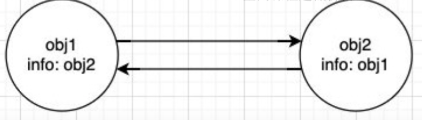
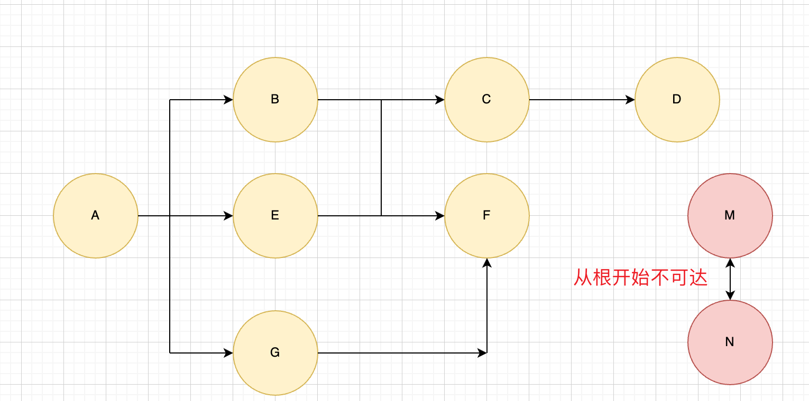

## JavaScript 内存管理

### 1、内存概念

- 不管什么样的编程语言，在代码的执行过程中都是需要给它**分配内存**的，不同的是某些编程语言需要我们自己手动的管理内存，某些编程语言会可以自动帮助我们管理内存

- 不管以什么样的方式来管理内存，内存的管理都会有如下的生命周期：

  - 第一步：分配**申请**你需要的内存（申请）
  - 第二步：第二步：使用**分配**的内存（存放一些东西，比如对象等）
  - 第三步：不需要使用时，对其进行**释放**；

- 不同的编程语言对于第一步和第三步会有不同的实现：
  - 手动管理内存：比如 C、C++，包括早期的 OC，都是需要手动来管理内存的申请和释放的（malloc 和 free 函数）；
  - 自动管理内存：比如 Java、JavaScript、Python、Swift、Dart 等，它们有自动帮助我们管理内存；

### 2、JS 的内存管理

#### 1.内存和垃圾回收器

- JavaScript 会在定义变量时为我们分配内存
- JavaScript 内存分配方式是一样吗？
  - JS 对于**基本数据类型内存**的分配会在执行时，直接在**栈**空间进行分配
  - JS 对于**复杂数据类型内存**的分配会在**堆内存**中开辟一块空间，并且将这块空间的**指针**返回值变量引用；
- 现代的编程语言都是有自己的立即回收机制
  - JS 对于复杂数据类型内存的分配会在堆内存中开辟一块空间，并且将这块空间的指针返回值变量引用；
  - 对于那些不再使用的对象，我们都称之为是垃圾，它需要被回收，以释放更多的内存空间；
  - 而我们的语言运行环境，比如 Java 的运行环境 JVM，JavaScript 的运行环境 js 引擎都会内存垃圾回收器；
  - 垃圾回收器我们也会简称为 GC，所以在很多地方你看到 GC 其实指的是垃圾回收器；

#### 2. 垃圾回收器算法

**2.1. GC - 引用计数**

- 当一个对象有一个引用指向它时，那么这个**对象的引用就+1**，当一个对象的引用为 0 时，这个对象就可以被销毁掉
- 这个算法有一个很大的**弊端**就是会产生**循环引用**
  

**2.2. GC - 标记清除**

- 这个算法是设置一个根对象（root object），垃圾回收器会定期从这个根开始，找所有从根开始有引用到的对象，对于哪些没有引用到的对象，就认为是不可用的对象；
- 这个算法可以很好的解决循环引用的问题

