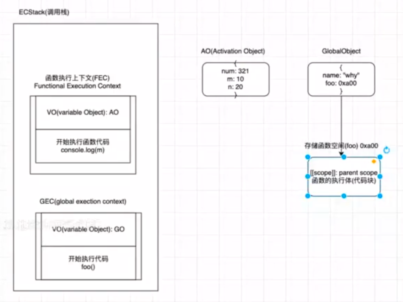
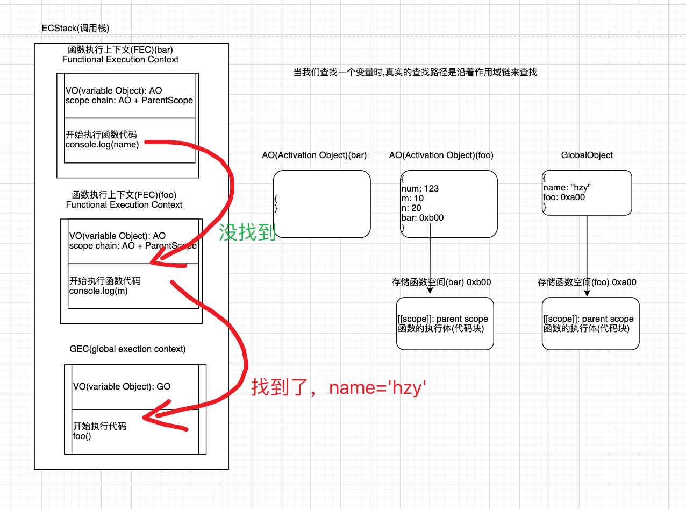
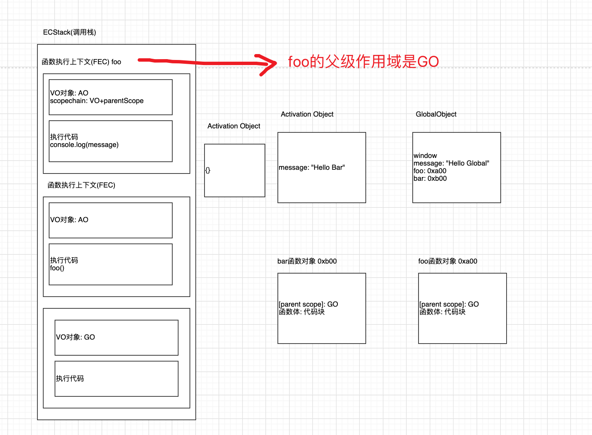
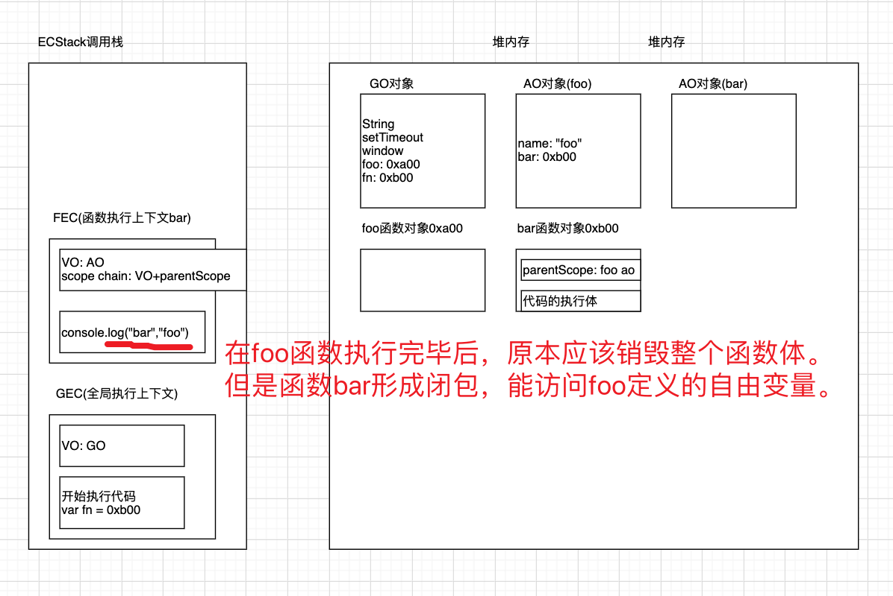
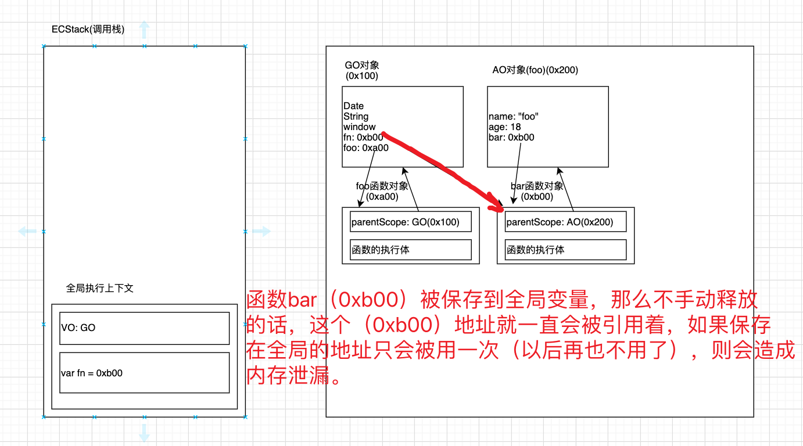

## 深入函数执行

### 1、函数执行上下文和作用域



```js
var name = 'hzy'

foo(123)
function foo(num) {
  console.log(m)
  var m = 10
  var n = 20

  console.log(m)
}
```

- 1. 整个代码执行的时候，先创建 `ECStack`(调用栈),在代码解析的时候，创建**全局执行上下文**`GEO(global execution context)`。同时**创建全局对象** `VO（variable Object）：GO`。将代码 `name` 放到全局对象中为 `undefined` 并赋值为 `hzy`。继续执行，发现有个函数，那么 `js` 将函数名放到全局对象中，然后为函数**创建新的存储空间**`(foo 0xa00)`
- 2. 创建函数新的空间后，将函数中**代码块放到空间中**。此时代码执行时，为创建**函数执行上下文**`(Functional Execution Context)`。在**函数的执行上下文中创建** `VO（variable Object）：AO`，函数 foo 的 AO 中将包含代码中的 `num:123,m=10,n=20`
- 3. 执行函数 `console.log(m)`则会获得 10

### 2、函数执行作用域链



```js
var name = 'hzy'

foo(123)
function foo(num) {
  console.log(m)
  var m = 10
  var n = 20

  function bar() {
    console.log(name)
  }

  bar()
}
```

- 上方 name 查找根据函数一层一层向上查找，最终找到了全局（`GO`）上的 name



```js
var message = 'Hello Global'

function foo() {
  console.log(message)
}

function bar() {
  var message = 'Hello Bar'
  foo()
}

bar()
```

- 上方的 `foo` 在执行时候的父级作用域是 `GO`，因此找到的 `message` 是全局（GO）
- 函数**定义**的时候的作用域就已经确定了，**函数的父级作用域和函数执行的位置没有关系**。

::: tip
**ECMA 版本规范标准**

**早期：**
每一个执行上下文会被关联到一个环境变量（variable object，VO），在源代码中的变量和函数声明会作为属性添加到 VO 中。对于函数来说，参数也会被添加到 VO 中。

**最新：**
每一个执行上下文会关联到一个变量环境中(VariableEnvironment)中，在执行代码中变量和函数的声明会作为环境记录（Environment Record）添加到变量环境中。对于函数来说，参数也会被环境记录添加到变量环境中。
:::

### 3、几个函数执行的面试题

#### 第一题

```js
var n = 100

function foo() {
  n = 200
}

foo()

console.log(n)
```

**答案**

```js
200
```

**解析**

- 全局定义 `n`，函数 `foo` 执行修改 `n` 的值，因为函数内没有定义 `n` 所以修改了全局的 `n`，因此打印出 `200`

#### 第二题

```js
function foo() {
  console.log(n)
  var n = 200
  console.log(n)
}

var n = 100
foo()
```

**答案**

```js
undefined
200
```

**解析**

- `var n` 是有提升，先定义 `n` 为 `undefined`，因此函数 `foo` 内部有 `n` 的定义，不需要去外层找
- 接着 `n=200`，则打印 `n` 肯定为 `200`

#### 第三题

```js
var a = 100

function foo() {
  console.log(a)
  return
  var a = 200
}

foo()
```

**答案**

```js
undefined
```

**解析**

- 函数在解析的时候是忽略 `return` 的，因此函数内会定义一个 `a=undefined`
- 函数执行打印 `a`，则为 `undefined`

#### 第四题

```js
var n = 100

function foo1() {
  console.log(n) // 2. 100
}

function foo2() {
  var n = 200
  console.log(n) // 1. 200
  foo1()
}

foo2()
console.log(n) // 3. 100
```

**答案**

```js
200
100
100
```

**解析**

- 函数先执行到 `foo2` 则打印为函数内定义的 `200`
- 紧接着 `foo1` 执行，则打印全局定义的 `n=100`
- 再就是外部打印的 `n` 则为全局的 `100`

#### 第五题

```js
function foo() {
  var a = (b = 100)
}

foo()

console.log(a)
console.log(b)
```

**答案**

```js
a is not defined

b = 100
```

**解析**

- 函数执行，函数内部会将定义变量那一行转换成两行代码
- `var a = 10; b = 10;`
- 因此 `a` 是在函数内的变量，我们访问不到，但是 `b` 前面**没有声明函数，会被提升到全局**，故可以访问到 `b`

### 4、JavaScript 中函数是一等公民

#### 函数是一等公民定义

- 函数可以作为另外一个函数的参数，也可以作为另外一个函数的返回值来使用。

1. **函数作为另一个函数的参数**

```js
function calc(num1, num2, calcFn) {
  console.log(calcFn(num1, num2))
}

function add(num1, num2) {
  return num1 + num2
}

function sub(num1, num2) {
  return num1 - num2
}

function mul(num1, num2) {
  return num1 * num2
}

var m = 20
var n = 30

calc(m, n, mul)
```

- 上方代码，`calc` 函数接受一个 `calcFn（是函数）` 参数作为一个函数
- 我们可以传入不同的 `calcFn` 函数定义，这样就可以有更好的扩展性

2. 函数会返回去另外一个函数作为返回值的函数

```js
function makeAdder(count) {
  function add(num) {
    return count + num
  }

  return add
}

var add5 = makeAdder(5)
console.log(add5(6)) // 11
console.log(add5(10)) // 15

var add10 = makeAdder(10)
console.log(add5(6)) // 16
```

:::tip
**高阶函数**

我们通常把一个函数如果接受另外一个函数作为参数，或者该函数会返回另外一个函数作为返回值的函数，称这个函数为高阶函数。
:::

### 5、数组中的函数使用

1. **函数和方法的区别**

   - 函数 `function`:独立的 `function`，称之为一个函数
   - 方法 `method`: 当我们的一个函数属于某一个对象时, 我们成这个函数是这个对象的方法

2. **filter：过滤**

```js
var nums = [10, 5, 11, 100, 55]
var newNums = nums.filter(function (item) {
  return item % 2 === 0 // 偶数
})
console.log(newNums)
```

3. **map: 映射**

```js
var nums = [10, 5, 11, 100, 55]
var newNums2 = nums.map(function (item) {
  return item * 10
})
console.log(newNums2) // [20,10,22,200,110]
```

4. **forEach: 迭代**

```js
var nums = [10, 5, 11, 100, 55]
nums.forEach(function (item) {
  console.log(item)
})

// 10,5,11,100,55
```

5. **find/findIndex**

```js
var nums = [10, 5, 11, 100, 55]
var item = nums.find(function (item) {
  return item === 11
}) // 11

var friends = [
  { name: 'hzy', age: 18 },
  { name: 'kobe', age: 40 },
  { name: 'james', age: 35 },
  { name: 'curry', age: 30 }
]

var findFriend = friends.find(function (item) {
  return item.name === 'kobe'
})
console.log(findFriend) // {name: 'kobe', age: 40}

var friendIndex = friends.findIndex(function (item) {
  return item.name === 'james'
})
// console.log(friendIndex) // 1
```

6. **reduce: 累加**

```js
var nums = [10, 5, 11, 100, 55]

var total = 0
for (var i = 0; i < nums.length; i++) {
  total += nums[i]
}
console.log(total) // 181

var total = nums.reduce(function (preValue, item) {
  return preValue + item
}, 0)
console.log(total) // 181
```

### 6、闭包

1. **闭包定义**

**维基百科**

- 闭包（英语：Closure），又称词法闭包（Lexical Closure）或函数闭包（function closures）；
- 是在支持头等函数的编程语言中，实现词法绑定的一种技术；
- 闭包在实现上是一个结构体，它存储了一个函数和一个关联的环境（相当于一个符号查找表）；
- 闭包跟函数最大的区别在于，当捕捉闭包的时候，它的自由变量会在补充时被确定，这样即使脱离了捕捉时的上下文，它也能照常运行；

**MDN**

- 一个函数和对其周围状态（lexical environment，词法环境）的引用捆绑在一起（或者说函数被引用包围），这样的组合就是闭包（closure）；
- 闭包让你可以在一个内层函数中访问到其外层函数的作用域
- 在 JavaScript 中，每当创建一个函数，闭包就会在函数创建的同时被创建出来

**个人总结**

- **闭包 = 函数本身 + 能访问的外层的自由变量**

- 一个普通的函数 `function`，如果它可以访问外层作用于的自由变量，那么这个函数就是一个闭包;
- **从广义的角度来说**:`JavaScript` 中的函数都是闭包;
- **从狭义的角度来说**:`JavaScript` 中一个函数，如果访问了外层作用于的变量，那么它是一个闭包;



```js
function foo() {
  // AO: 销毁
  var name = 'foo'
  function bar() {
    console.log('bar', name)
  }

  return bar
}

var fn = foo()
fn()
```

- 结合上述代码和图片，在执行 `var fn = foo()`这一行时候，当 `foo` 函数执行完毕，原本应该销毁整个函数和函数的自由变量。
- 但是函数 `foo` 执行后，返回了 `bar` 函数。那么在执行 `fn()`这一行代码的时候，则会执行执行 `bar` 函数的引用
- 最终执行 `bar` 的 `name` 则会去找 `foo` 函数中定义的 `name` 变量

2. **闭包的场景**



```js
function foo() {
  var name = 'foo'
  var age = 18

  function bar() {
    console.log(name)
    console.log(age)
  }
  return bar
}

var fn = foo()
fn()

fn = null
```

- 根据上图和代码，函数 `foo` 在执行会形成 `AO`，但是 `foo` 执行最后一行会将函数 `bar` 返回
- 这样我们定义的 `fn` 就在全局保存了一个 `bar` 函数的内存地址，当 `foo` 函数执行完成以后，理论上是需要销毁 `foo` 的所有变量，但是此时的 `bar` 函数的内存地址被全局的 `fn` 占着，因此此时 `bar` 函数的内存地址不会被销毁
- 如果我们只使用一次 `fn` 这个函数，以后再也不使用，那么这个引用则一直会存在于全局。从而导致内存泄漏
- 解决方法：我们手动将 `fn=null`,这样 `Chrome` 的标记清除算法则从根走不到这个地址，`JS` 引擎就会将其清除。
