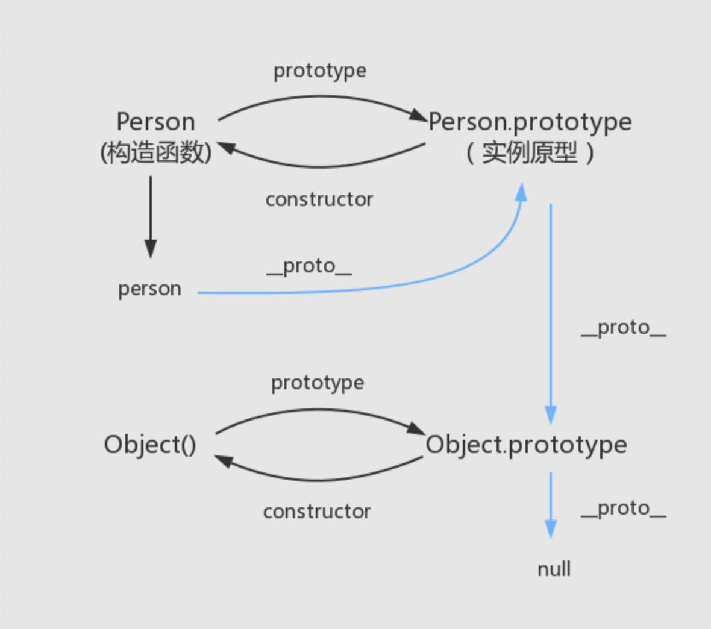

:::tip
学习主要推荐冴羽老哥的文章

[JavaScript 深入之从原型到原型链 ](https://github.com/mqyqingfeng/Blog/issues/2)
:::

## 1. 原型和原型链继承

### 1.1 原型和原型链设置方法



```js
// 概念介绍
Person： 构造函数

person: 实例

Person.prototype === person.__proto__
```

- **实现原型链继承方法**

```js
function Person(name, age, height, address) {
  this.name = name
  this.age = age
  this.height = height
  this.address = address
}

Person.prototype = {
  constructor: Person,
  eatings: function () {
    console.log(this.name + '在吃东西')
  },

  runnings: function () {
    console.log(this.name + '在跑步')
  }
}

Object.defineProperties(Person.prototype, {
  constructor: {
    enumerable: false,
    configurable: true,
    writable: true,
    value: Person
  }
})

const p1 = new Person('hzy', 18, 1.88, '北京市')
const p2 = new Person('kobe', 20, 1.98, '洛杉矶市')

console.log(p1)

p1.eatings()
p2.runnings()

console.log(p1.eatings === p2.eatings)
console.log(p1.runnings === p2.runnings)
```

- 上述代码，我们在 `Person` 的 `prototype` 中添加了 `eatings` 和 `runnings` 方法。此时只要是用 `new Person` 构造出的对象，都可以在原型链上访问到共有方法 `eatings` 和 `runnings`
- 需要注意：在我们设置 `Person.prototype = {}`此时回去的原型链会被断开，因此我们需要在设置对象的时候添加 `constructor` 属性来保持原型链。
- 最终，使用 `Object.defineProperties` 将 `constructor` 上的 `enumerable` 属性设置为 `false`

### 1.2 var obj1 = {} 发生了什么

1. 在内存中创建一个对象,`var obj1 = {}`
2. this 的赋值，`this = obj1`
3. 将 `Object` 函数的显示原型 `prototype` 赋值给前面创建出来的对象的隐式原型。`obj1.\_\_proto\_\_ = Object.prototype`

### 1.3 **实现原型链继承**

- 原型链实现继承的**弊端**:
  - 1. 第一个弊端: 打印 stu 对象, 继承的属性是看不到的
  - 2. 第二个弊端: 创建出来两个 stu 的对象
  - 3. 第三个弊端: 在前面实现类的过程中都没有传递参数

```js
// 父类：公共属性和方法
function Person() {
  this.name = 'hzy'
  this.friends = []
}

Person.prototype.eating = function () {
  console.log(this.name + ' eating~')
}

function Student() {
  this.sno = 111
}

// 核心代码
Student.prototype = new Person()

Student.prototype.studying = function () {
  console.log(this.name + ' studying')
}

// 原型链实现继承的弊端:
// 1.第一个弊端: 打印stu对象, 继承的属性是看不到的
// console.log(stu.name)

// 2.第二个弊端: 创建出来两个stu的对象
const stu1 = new Student()
const stu2 = new Student()

// 直接修改对象上的属性, 是给本对象添加了一个新属性
stu1.name = 'kobe'
console.log(stu2.name)

// 获取引用, 修改引用中的值, 会相互影响
stu1.friends.push('kobe')

console.log(stu1.friends)
console.log(stu2.friends)

// 3.第三个弊端: 在前面实现类的过程中都没有传递参数
const stu3 = new Student('nice', 112)
```

### 1.4 借用构造函数继承

- 优点
  - 解决了前面原型链继续的三个弊端
- 借用构造函数也是有**弊端**：
  - 1.第一个弊端: Person 函数至少被调用了两次
  - 2.第二个弊端: stu 的原型对象上会多出一些属性, 但是这些属性是没有存在的必要

```js
function Person(name, age, height, friends) {
  this.name = name
  this.age = age
  this.height = height
  this.friends = friends
}

Person.prototype.eatings = function () {
  console.log(this.name + ' eating~')
}

function Student(name, age, height, friends) {
  // 核心代码
  Person.call(this, name, age, height, friends)
}

Student.prototype = new Person()

Student.prototype.studying = function () {
  console.log(this.name + ' studying~')
}

const stu1 = new Student('NBA', 23, 190, [])
const stu2 = new Student('hzy', 18, 1.88, [])

stu1.friends.push('nice')
stu2.friends.push('kobe')

console.log(stu1) // Person { name: 'NBA', age: 23, height: 190, friends: [ 'nice' ] }
console.log(stu2) // Person { name: 'hzy', age: 18, height: 1.88, friends: [ 'kobe' ] }
```

### 1.5 一个错误的继承

- 错误的继承
  - 可以实现功能，但是给子类添加方法会污染父类

```js
// 一个错误的继承
function Person(name, age, height, friends) {
  this.name = name
  this.age = age
  this.height = height
  this.friends = friends
}

Person.prototype.eating = function () {
  console.log(this.name + 'eating')
}

function Student(name, age, height, friends) {
  Person.call(this, name, age, height, friends)
}

// 核心代码
Student.prototype = Person.prototype

Student.prototype.studying = function () {
  console.log(this.name + '在学习')
}

const stu1 = new Student('NBA', 23, 190, [])
const stu2 = new Student('hzy', 18, 1.88, [])

stu1.friends.push('nice')
stu2.friends.push('kobe')

// 我们在Student上加的方法同时也被添加到了Person上，这个是我们不希望的
console.log(Person.prototype) // { eating: [Function (anonymous)], studying: [Function (anonymous)] }

console.log(stu1) // Person { name: 'NBA', age: 23, height: 190, friends: [ 'nice' ] }
console.log(stu2) // Person { name: 'hzy', age: 18, height: 1.88, friends: [ 'kobe' ] }
```

### 1.6 原型式继承

- 核心
  - 无非是将某个新创建出的对象的\_\_proto\_\_指向原来的那个对象
- 局限
  - 只能是对象

```js
// 原型式继承
const obj = {
  name: 'hzy',
  age: 18
}

const info = Object.create(obj)

// Object.create实现原理
function createdObjectOne(o) {
  let newObj = {}
  Object.setPrototypeOf(newObj, o)
  return newObj
}

// 道格拉斯
function createdObjectTwo(o) {
  function Fn() {}
  Fn.prototype = o
  const newObj = new Fn()
  return newObj
}

const info1 = createdObjectTwo(obj)
console.log(info1.__proto__) // { name: 'hzy', age: 18 }
```

### 1.7 寄生式继承

- **寄生式继承 = 原型式继承 + 工厂函数**
  - **缺点**： 工厂函数不明确，并且每个创建的对象都有共有的方法和属性

```js
const obj = {
  running: function () {
    console.log('running')
  }
}

function createdStudent(name) {
  const stu = Object.create(obj)
  stu.name = name
  stu.studying = function () {
    console.log('studying')
  }
  return stu
}

const stuObj = createdStudent('hzy')
const stuObj1 = createdStudent('nice')

console.log(stuObj) // { name: 'hzy', studying: [Function (anonymous)] }
console.log(stuObj1) // { name: 'nice', studying: [Function (anonymous)] }
```

### 1.8 寄生式组合继承

- **寄生式组合继承 = 寄生式继承 + 借用构造函数继承**

```js
// 寄生式组合继承

// 核心代码一
function createNewObj(o) {
  function Fn() {}
  Fn.prototype = o
  return new Fn()
}

// 核心代码二
function inheritProperty(SubType, SuperType) {
  // SubType.prototype = Object.create(SuperType.prototype)
  SubType.prototype = createNewObj(SuperType.prototype)
  Object.defineProperties(SubType.prototype, {
    constructor: {
      enumerable: false,
      configurable: true,
      writable: true,
      value: SubType
    }
  })
}

function Person(name, age, height) {
  this.name = name
  this.age = age
  this.height = height
}

Person.prototype.eatings = function () {
  console.log(this.name + ' eatings')
}

function Student(name, age, height, sno, friends) {
  Person.call(this, name, age, height)
  this.sno = sno
  this.friends = friends
}

inheritProperty(Student, Person)

Student.prototype.runnings = function () {
  console.log(this.name + ' runnings')
}

const stu1 = new Student('hzy', 18, 1.88, 32, ['nice'])
const stu2 = new Student('hzy', 18, 1.88, 32, ['kobe'])
console.log(stu1)
console.log(stu2)
stu1.runnings()
stu1.eatings()
stu2.runnings()
stu2.eatings()

stu1.friends.push('nicy')
console.log(stu1.friends)
console.log(stu2.friends)
```

## 2. 原型链判断方法（API）

### 2.1. [hasOwnProperty](https://developer.mozilla.org/zh-CN/docs/Web/JavaScript/Reference/Global_Objects/Object/hasOwnProperty)

- hasOwnProperty() 方法会返回一个布尔值，指示对象自身属性中是否具有指定的属性（也就是，是否有指定的键）。

```js
const obj = {
  name: ' hzy',
  age: 18
}

const info = Object.create(obj, {
  address: {
    value: '南京',
    enumerable: true
  }
})

console.log(info) // { address: '南京' }
console.log(info.__proto__) // { name: ' hzy', age: 18 }

console.log(info.hasOwnProperty('address')) // true
console.log(info.hasOwnProperty('name')) // false
```

### 2.2 [in 操作符](https://developer.mozilla.org/zh-CN/docs/Web/JavaScript/Reference/Operators/in)

- 如果指定的属性在指定的对象或其原型链中，则 in 运算符返回 true。

```js
// in 操作符
console.log('address' in info) // true
console.log('name' in info) // true

for (let key in info) {
  console.log(info[key]) // 南京 hzy 18
}
```

### 2.3 [instanceof](https://developer.mozilla.org/zh-CN/docs/Web/JavaScript/Reference/Operators/instanceof)

- instanceof 运算符用于检测**构造函数**的 prototype 属性是否出现在某个实例对象的原型链上。

```js
function createNewObj(o) {
  function Fn() {}
  Fn.prototype = o
  return new Fn()
}

function inheritProperty(SubType, SuperType) {
  // SubType.prototype = Object.create(SuperType.prototype)
  SubType.prototype = createNewObj(SuperType.prototype)
  Object.defineProperties(SubType.prototype, {
    constructor: {
      enumerable: false,
      configurable: true,
      writable: true,
      value: SubType
    }
  })
}

function Person() {}

function Student() {}

inheritProperty(Student, Person)

const stu = new Student()

console.log(stu instanceof Student) // true
console.log(stu instanceof Person) // true
console.log(stu instanceof Object) // true
```

### 2.4 [isPrototypeOf](https://developer.mozilla.org/zh-CN/docs/Web/JavaScript/Reference/Global_Objects/Object/isPrototypeOf)

- isPrototypeOf() 方法用于测试**一个对象是否存在于另一个对象**的原型链上。

```js
console.log(Person.prototype.isPrototypeOf(stu)) // true

const obj1 = {
  name: 'why',
  age: 18
}

const info1 = Object.create(obj1)

console.log(obj1.isPrototypeOf(info1)) // true
```
